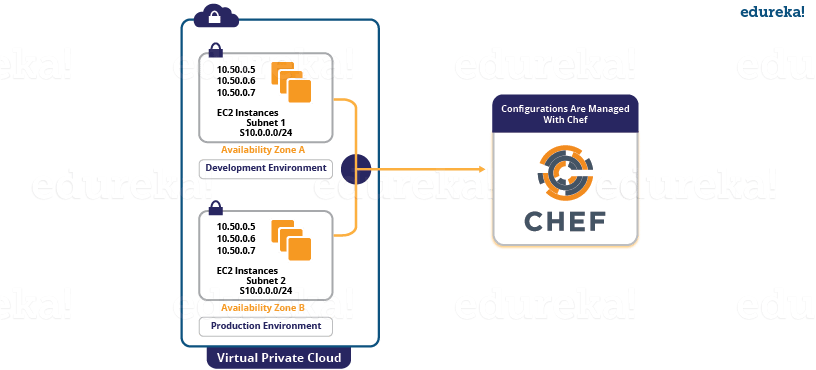

# What is Chef?

Chef is an automation tool that provides a way to define infrastructure as code. Infrastructure as code (IAC) simply means that managing infrastructure by writing code (Automating infrastructure) rather than using manual processes. It can also be termed as programmable infrastructure. Chef uses a pure-Ruby, domain-specific language (DSL) for writing system configurations. Below are the types of automation done by Chef, irrespective of the size of infrastructure:

* Infrastructure configuration
* Application deployment 
* Configurations are managed across your network

Like Puppet which has a Master-Slave architecture even Chef has a Client-Server architecture. But Chef has an extra component called Workstation. I will talk about workstation in my next blog. Refer the diagram below:

In Chef, Nodes are dynamically updated with the configurations in the Server. This is called Pull Configuration which means that we don’t need to execute even a single command on the Chef server to push the configuration on the nodes, nodes will automatically update themselves with the configurations present in the Server. My next blog on Chef Tutorial will explain the Chef architecture along with all the Chef components in detail.

Now, let us look at reasons behind the popularity of Chef.

## What Is Chef – Chef Key Metrics

* Chef supports multiple platforms like AIX, RHEL/CentOS, FreeBSD, OS X, Solaris, Microsoft Windows and Ubuntu. Additional client platforms include Arch Linux, Debian and Fedora.
* Chef can be integrated with cloud-based platforms such as Internap, Amazon EC2, Google Cloud Platform, OpenStack, SoftLayer, Microsoft Azure and Rackspace to automatically provision and configure new machines.
* Chef has an active, smart and fast growing community support.
* Because of Chef’s maturity and flexibility, it is being used by giants like Mozilla, Expedia, Facebook, HP Public Cloud, Prezi, Xero, Ancestry.com, Rackspace, Get Satisfaction, IGN, Marshall University, Socrata, University of Minnesota, Wharton School of the University of Pennsylvania, Bonobos, Splunk, Citi, DueDil, Disney, and Cheezburger.

### According to Phil Dibowitz, Production Engineer, Facebook

*“There are three dimensions of scale we generally look at for infrastructure — the number of servers, the volume of different configurations across those systems, and the number of people required to maintain those configurations. Chef provided an automation solution flexible enough to bend to our scale dynamics without requiring us to change our workflow.”*

Without a doubt Chef is one of the most famous Configuration Management tools and is closely competing with Puppet. But, before diving deep into “What is Chef”, it’s only fair that I first explain what is Configuration Management and why it is important.

## Configuration Management
Let us understand Configuration Management this way – suppose you have to deploy a software on top of hundreds of systems. This software can be an operating system or a code or it can be an update of an existing software. You can do this task manually, but what happens if you have to finish this task overnight because tomorrow might be a Big Billion Day sale in the company or some Mega Sale etc. in which heavy traffic is expected. Even if you were able to do this manually there is a high possibility of multiple errors on your big day. What if the software you updated on hundreds of systems is not working, then how will you revert back to the previous stable version, will you be able to do this task manually? AF-course not!

To solve this problem, Configuration Management was introduced. By using Configuration Management tools like Chef, Puppet, etc. you can automate this task. All you have to do is to specify the configurations in one centralized server and accordingly all the nodes will be configured. It allows access to an accurate historical record of system state for project management and audit purposes. So basically, we need to specify the configurations once on the central server and replicate that on thousands of nodes. Configuration Management helps in performing the below tasks in a very structured and easy way:

* Figuring out which components to change when requirements change.
* Redoing an implementation because the requirements have changed since the last implementation.
* Reverting to a previous version of the component if you have replaced with a new but flawed version.
* Replacing the wrong component because you couldn’t accurately determine which component was supposed to be replaced.

There are broadly two ways to manage your configurations namely Push and Pull configurations.

* **Pull Configuration:**  In this type of Configuration Management, the nodes poll a centralized server periodically for updates. These nodes are dynamically configured so basically they are pulling configurations from the centralized server. Pull configuration is used by tools like Chef, Puppet etc.
* **Push Configuration:** In this type of Configuration Management, the centralized Server pushes the configurations to the nodes. Unlike Pull Configuration, there are certain commands that have to be executed in the centralized server in order to configure the nodes. Push Configuration is used by tools like Ansible.

## What Is Chef – Configuration Management With Chef
We have understood what is Chef, now I will explain you how Chef achieves Configuration Management with a use-case. Gannett is a publicly traded American media holding company. It is the largest U.S. newspaper publisher as measured by total daily circulation.

Gannett’s traditional deployment workflow was characterized by multiple handoffs and manual tests. Let us see what were the problems they faced with this process:

* Maintaining accurate, repeatable builds was difficult.
* There were many build failures and tests were often running in the wrong environments.
* Deployment and provisioning times could range from a few days to several weeks.
* Operations team didn’t have access to the cloud or development environments.
* Every group used its own tool-set, and there was no accountability to finance or security. No one knew how much an application actually cost. Security had no way to audit the software stacks.
Gannett was ready for the change. Developers wanted to deploy their applications quickly. Operations wanted a stable infrastructure where they could build and deploy in a repeatable way. Finance wanted to know the true cost of an application. Security wanted to view and audit all stacks and to be able to track changes.

Gannett saw that cloud as a service offered many advantages. Developers had access to standardized resources. It was easier to handle peaky traffic because of cloud’s compute-on-demand model, and handoffs were minimized.

Chef allows you to dynamically provision and de-provision your infrastructure on demand to keep up with peaks in usage and traffic. It enables new services and features to be deployed and updated more frequently, with little risk of downtime. With Chef, you can take advantage of all the flexibility and cost savings that cloud offers. 

Let us see what were the functions performed by Chef at Gannett:

* Gannett started building VPC (Virtual Private Cloud) for development environment that would mimic the production. None of the tools that they were already using were appropriate. But they found that Chef worked well with the cloud and both Linux and Windows environment. They used Chef to build a development environment that perfectly matched production environment.
* For an application to move into the VPC, it had to be provisioned and deployed with Chef.
* Security would be involved early on and would manage the mandatory controls for access to Chef and for maintaining system security standards.

